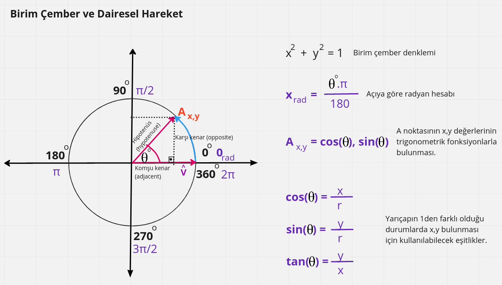
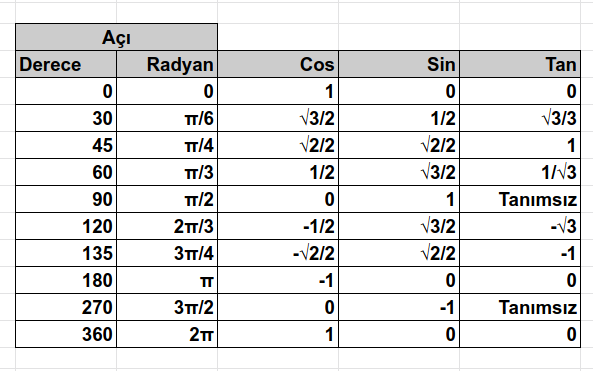
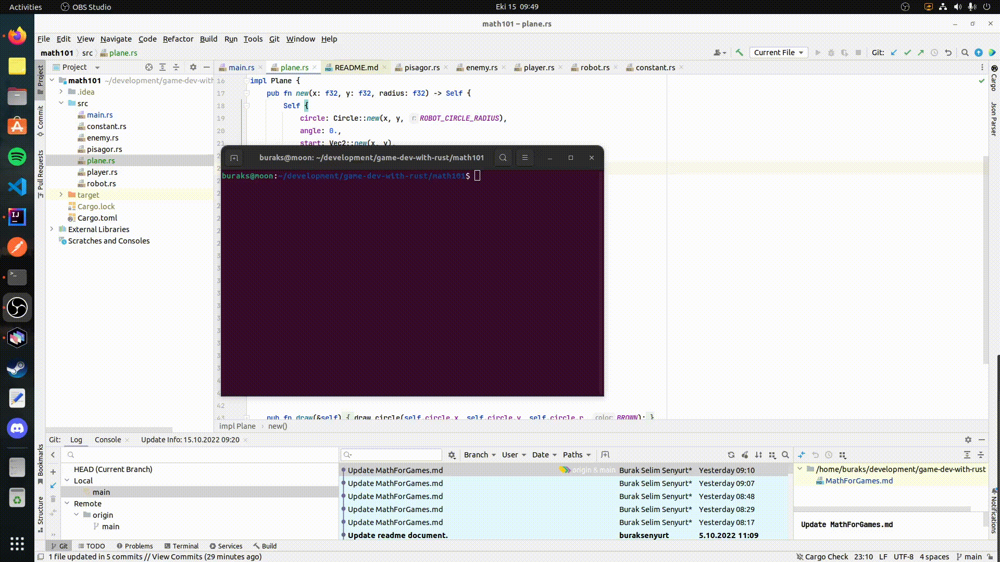

# Oyun Geliştirmede Kullanılan Temel Matematik Enstrümanlar

**Konu ile ilgili daha derli toplu bir makaleye [medium hesabımdan](https://medium.com/@burakselyum/oyun-geli%C5%9Ftirmede-kullan%C4%B1lan-temel-matematik-enstr%C3%BCmanlar-66e5cc062eca) erişebilirsiniz.**

Oyun motorları arasında popüler olan Unity, Unreal gibi pek çok platform fizik motorlarından ışıklandırmaya, gölgeleme efektlerinden çarpışma hesaplamalarına kadar pek çok şeyi hazır olarak sunar. Ancak oyun programlamanın temellerinde her zaman olduğu gibi matematik vardır _(Az cebir fazlasıyla da trigonometri)_ Bu anlatımda temel seviyede oyun geliştirme için bilinmesi gereken matematik enstrümanlara yer verilmekte. İlk olarak en basit teori ile başlayalım.

## Pisagor Teoremi

Oyuncunun roketi iki boyutlu sahada ilerlerken etrafını saran düşman gemileri rast gele yönlerde hareket ediyordu. Bazı düşman gemileri oyuncuya belli mesafe yaklaşınca ateş açıyordu. İşte soru; düşman gemisinin ateş etmek için oyuncuya ne kadar yaklaştığını nasıl buluruz? Problemi basitleştirmek adına oyunun iki boyutlu bir sahada yazıldığını düşünelim. Pek çok oyun motorunda koordinat düzlemi ekranın sol üst köşesini 0,0 başlangıç noktası olarak kabul eder. Bizde böyle olduğunu düşünebiliriz. Tabii 2D kartezyen koordinat sisteminde olduğumuz için işimiz nispeten kolay. Lakin 3 boyutlu kartezyen sistemine geçtiğimizde sağ el veya sol el kurallarına göre koordinat sisteminin 24 farklı versiyondan kullanılması söz konusu. Şimdilik bu detayları geride bırakalım ve problemimize geri dönelim.

Aslında oyun karakterlerinin _(sprite olarak ifade edebiliriz)_ merkez x,y değerlerini biliyorsak, bir dik üçgenden yararlanarak hipotenüs hesabından hareketle yakınlık değerini bulabiliriz. Bunu çok basit anlamda denemek için Rust ile yazılmış math101 örneğine bakılabilir. Aşağıda gördülüğü gibi daire, kareye 50 pixel mesafeden daha fazla yaklaştığında ekrana bir uyarı mesajı geliyor.

## Vektörler ve Açılar

Oyunlarda vektörler sıklıkla kullanılır. Bir vektör ile büyüklük _(daha çok uzunluk olarak da rastlarız)_ ve en önemlisi yön bilgisi ifade edilir. Bu sayede oyun sahasındaki bir nesnenin hareket yönü vektörler ile ifade edilebilir. Büyüklük _(Magnitude)_ yerine yönün _(direction)_ önemli olduğu durumlarda da birim vektörler öne çıkar. Bir vektörün uzunluğunu _(büyüklüğünü)_ bulmak için de pisagor teoremi kullanılabilir. Nitekim uzaydaki bir vektörün uzunluğu iki nokta arasındaki mesafeye tekabül eder ki bu da pisagor üçgeninden yararlanılarak hesap edilir.

Aslında matematiğin oyun programlama tarafındaki yorumlamaları çok önemli. Onları sadece matematiksel formüller veya tanımlar olarak değil fiziki dünyada anlamlandırılan birer enstrüman olarak düşünmek lazım. Bu anlamda üstteki grafiği biraz yorumlamaya çalışalım. Aracın son konumu merkez koordinat noktası düşünüldüğünde Ex ve Ey ile ifade edilebilir. Burası aynı zamanda vektörel olarak da ifade edilebilir. Ex,Ey'yi vektör olarak düşündüğümüzde şöyle bir paragraf düşünebiliriz. Oyuncunun arabası güney doğu yönünde 4 birim ilerledikten sonra doğuya doğru 2 birim ardından güneye 2.5 birim ve sonrasında güney batıya doğru 3 birim hareket etmektedir. Bir başka deyişle vektörler aslında nesnelerin er değiştirmeleri ile sıkı bir şekilde ilgilenir. Bu nedenle Ex,Ey'nin standart olarak x,y cinsinden merkeze uzaklığının ifadesinden farklı bir anlam taşır. Daha iyi anlamak için şöyle bir örnek verelim. Oyuncunun uzay gemisi kuzey yönünde saatte 340 km hızında ilerliyor. Burada dikkat edileceği üzere herhangi bir uzay koordinatı bilgisi yoktur. Bu tamamen göreceli bir olgu haline gelmiştir. Konum düşman gemisine göre farklı, oyuncunun baktığı ekrana göre farklı ve hatta güneşin konumuna göre farklıdır. Vektörel olarak ifadesi ile aslında yönü ve büyüklüğü _(ki burada hız oluyor)_ ifadesi söz konusudur.

Bu sebeplerden vektörler sayesinde bir noktanın merkeze olan uzaklığını ifade etmek de kolaydır. Örneğin görseldeki araba her yön değiştirdiğinde gitti mesafeyi büyüklük olarak kabul eden ve bir yönü olan vektörler ile matematiksel olarak ifade edilebilir. Buna göre aracın son geldiği Ex,Ey noktasının vektörel formdaki karşılığını bulmak kolaydır. Ayrıca Ex,Ey noktasının vektörel ifadesi arabanın merkezden _(merkez olarak başka bir nesne konumu örneğin yol kenarındaki bariyer de kabul edilebilir)_ ne kadar uzakta olduğunu söyler. Lakin az önce belirttiğimiz üzere özellikle iki boyutlu saha kullanan oyunlarda vektörün büyüklüğü _(uzunluğu)_ göz ardı edilebilir. Yön _(direction)_ daha önemlidir. Bu sebeple birim vektöre _(Unit Vector)_ sıklıkla rastlanır. Herhangi bir vektörü normalleştirme _(normalizing)_ işlemine tabi tutarak birim vektör cinsinden ifade etmek mümkündür.

Vektörlerde 0,0 konumuna göre kurulan dik üçgenlerden yararlanılarak yönü belirten açılar da kolaylıkla hesaplanabilir. Genelde bu hesaplamalar dik üçgenin karşıt kenarı ile komşu kenar arasındaki oranın arktanjantı şeklinde hesaplanır _(tanjantının -1 üssüdür esasında)_ ve derece cinsinden bulunur. Oyun motorlarının çoğunda derece yerine radyan kullanılır. Bir daireyi dört eşit dilim olarak böldüğümüzde radyan ile dilimlerin pi değeri cinsinden ifade edilmesi sağlanır. Bulunan açının radyana çevrilmesi ya da tam tersinin yapılması da formüller ile mümkündür.

Yön için önem arz eden açının bulunmasında sadece tanjant değil zaman zaman sinüs ve kosinüs fonksiyonları da kullanılabilir. Aslında varmak istediğim nokta biraz da şu. Elimizde radyan cinsinden açı ve örneğin bir kenar bilgisi varsa oluşan dik üçgenin diğer kenarını hesap etmek, başka bir deyişle hedef x,y koordinatlarına ulaşmak kolaydır. Buna göre,

- Elimizde açının karşı kenar uzunluğu ile hipotenüs değeri varsa sinüs fonksiyonundan yararlanılarak açı bulunabilir.
- Elimizde bulunmak istenen açının karşıt kenar uzunluğu ile komşu kenar uzunluğu varsa tanjant fonksiyonundan yararlanılır.
- Son olarak elimizde, bulunmak istenen açının komşu kenar uzunluğu ile hipotenüs değeri varsa kosinüs fonksiyonundan yararlanılabilir.

Bu noktada açı ile vektör arasındaki ilişkiyi ve dolayısıyla bir vektörün yönünü bulmayı iyi anlamak gerekir. Elimizde bir açı varsa birim vektör cinsinden yönü bulmak oldukça kolaydır. Buna göre açının sinüsü y değerini, kosinüsü de x değerini bulmamızı sağlar. Araştırmalarıma göre açı bilgisine sahip olduğumuz durumlarda x,y değerlerinden hangisinin kosinüs hangisinin sinüs ile hesaplanacağını alfabetik sıralamalardan bulabiliriz. x, y'den önce geldiği için cos'da sin'den önce geldiği için...Sanırım ne demek istediğimi anladınız :)

Sinüs eğrisinin kullanıldığı örnek kod parçasının çalışması aşağıdaki gibidir. Sol ve sağ ok tuşlarına basıldığında dairenin x kooridanatı değerine göre sinüs değeri hesaplanır ve y değeri buna göre değiştirilir. Sonuçta altın renkli topun sinüs eğrisine göre hareketi söz konusudur. Tabi normalde sinüs eğrisine baktığımızda ilk hareketin yukarı yönlü başladığını görürüz. Ancak burada koordinat sisteminde 0,0 orjininin ekranın sol üst köşesinde olduğunu hatırlayalım. Yine de y değerinin artım ve azaltımını duruma göre değiştirip aşağı ve yukarı yönlü hareketleri kontrol edebileceğimizi unutmayalım. Burada çok katı kurallarla düşünmesek de olabilir. Oyun sahası oyuncunun hakimiyetindedir ve oyun programlamada altın bir kuraldan bahsedilir. Doğru görünüyorsa doğrudur _(If it looks right, it is right)_

## Nokta Çarpım _(Dot Product)_

İki boyutlu oyun sahasında nesnelerin yönleri arasındaki açının değerlendirildiği pek çok durum var. Örneğin bir uçağın bir checkpoint noktasından geçip geçmediğini anlarken ya da yokuş aşağıya indiğini veya bir yokuşu çıktığını hesaplarken açıları kullanabiliriz. Aşağıdaki gösterimde uçağın yönü ile checkpoint noktasının yönü arasındaki ilişkinin nokta çarpım ile ele alınışı değerlendirilmekte. Bu senaryolarda birim vektörlerin göz önüne alındığını baştan belirteyim. Nitekim buradaki senaryoda vektörün büyüklüğünden ziyade yönü önemli. Birim vektör cinsinden bir nesnenin yönünü ifade ettiğimizde aradaki açıyı bulmak için nokta çarpımı formülasyonundan da yararlanabiliyor. Nokta çarpım hesaplaması ters tanjant ya da ters kosinüs ile bulunan açı hesaplamasına göre işlemciye daha az yük bindirmekte. Yani işlem maliyeti çok daha ucuz. Bu sebeple pek çok oyun motoru bu fonksiyonelliği hazır olarak da sunmakta.

Nokta çarpımını birim vektöre indirgediğimizde elde edilen skalar değer -1 ile 1 aralığında olacaktır. Buna göre vektörlerin aynı veya ters yönde olduklarını ya da birbirlerine yaklaştıklarını veya uzaklaştıklarını anlayabiliriz. Yani açısal olarak anlamlandırdığımızda dar veya geniş açıların farkındalığına göre bir karar verebiliriz. Aşağıdaki görselde birim vektörlerin konumlarına göre uç nokta değerleri görülmektedir. Şimdi size kendi başınıza bir çalışma önerisinde bulunayım. Sağ vektörün bitiş noktasından tekrar kendisine gelecek şekilde bir çember çizin. Çemberin ana kartezyen doğruları ile kesim noktalarını pi cinsinden ifade etmeye çalışın. Ardından çember üstündeki herhangi bir noktanın x,y koordinat değerlerini trigonometrik fonksiyonları kullanarak bulmayı deneyin. İşte bir çember yörüngesinde hareket ettirmek istediğiniz uzay gemisi için gerekli hesaplamaların temel matematiğini keşfettiniz.

## Doğrusal İnterpolasyon _(Linear Interpolation)_

Oyun sahasında başvurulan matematik enstrümanlarından bir diğeri de Linear Interpolation kavramıdır. Örneğin motion efektlerinde, belli bir rotayı izlemesi istenen unsurlarda, renk geçişlerinde, giderek hızlanan veya yavaşlayan nesnelerde sıklıkla başvurulur. En basit formu da iki nokta arasında gidilmesi istenen mesafenin sürece kesin olduğu hareket efektleridir. Örneklendirirsek daha iyi olacaktır. Diyelim ki 2D kartezyen sisteminde x,y değerlerini bildiğimiz A ve B noktaları var. Diğer yandan düşman gemisinin A noktasından B noktasına tam tamına 10 saniyede gideceğini planlıyoruz. Amacımız herhangi bir t anında bu nesnenin iki nokta arasındaki doğruda hangi x,y koordinatlarında olduğunu öğrenmek ki buna göre onun otomatik hareketlenmesini sağlamamız mümkün olur. Aşağıdaki grafikte bu hesaplama için kullanılabilecek formüllere yer veriliyor.

Başlangıç aşamasında A konumunda olan nesnenin 10ncu saniyede B konumunda olacağını biliyoruz. Buna göre örneğin C konumundan geçerken ki x,y koordinatlarını bulmak istersek nasıl bir formül kullanabiliriz? Esasında zaman çizelgesini yüzdesel olarak ifade edersek işimiz çok daha kolaylaşıyor. Başlangıç konumu olasılığı %0 hali ile ifade edilirse 10ncu saniyede varış noktasına gelmiş olmamız da %100'e karşılık gelir. Yani varış noktasında isek nesne yüzde yüz kesinliklte rotasını tamamlamıştır. Bir başka deyişle başlangıç ve bitiş noktalarını yüzdesel olarak düşündüğümüzde 0 ile 1 arasında yer alan bir olasılık değerinden bahsedebiliriz. Bu değer formülümüzdeki t parametresine karşılık gelir ve oyunda kullanılan FPS _(frame per second)_ bilgisine göre ayarlanır. Örneğin her bir frame 0.1 saniyede geçiliyorsa bir T anını T = T + 0.1 gibi ifade edebiliriz. Kendi senaryomuzda bu T değerinin 10'a bölümü hesaplamadaki t değerini verecektir. Bir başka deyişle elimizde FPS değeri de varsa herhangi bir andaki t değerini hesaplamak kolaydır.

İşin zorlaştığı noktalardan bir tanesi yerçekiminin devreye girdiği ya da rotanın doğrusal olarak ifade edilemediği eğrilerden oluşan senaryolardır. Örneğin önündeki tepeden space tuşuna basınca sıçyarak karşı tepeye ulaşmaya çalışan bir arabayı göz önüne alalım. Böyle bir durumda yerçekimine göre bir eğri çizilmesi ve bunun zaman bağımlı olarak hesaplanması gerekir. Bu senaryo için aşağıdaki şekli göz önüne alabiliriz. Hareket halindeki aracın bulunduğu noktayı bir vektör olarak ifade edeceğiz _(P ile ifade edilen kısım)_. Ayrıca t anında gittiği yönü taşıyan birde hız vektörü kullanmaktayız _(V ile ifade edilen)_. t ile oyun motorlarının bize genellikle hazır olarak verdiği delta time değerini ifade ediyoruz. Nitekim oyuncunun oynadığı platform ne olursa olsun herkesin aynı süresel değeri kullanması önemli. Çok oyunculu çevrimiçi platformlarda da FPS farklılıklarını ortadan kaldıracak bir özellik diyebiliriz sanırım.

Aracın t+1 anındaki konumunu ifade eden vektörü bulmak için hız vektörü ile delta time bilgisinin yer aldığı bir formül kullanılır. Ancak öncesinde o anki hız değerini işaret eden vektörün yine delta time ve yer çekimi vektörünün hesaba katılacağı bir formül ile bulunması gerekir. A ile ifade edilen _(genelde Acceleration olarak bilinir)_ vektör bu senaryoda yerçekimini işaret eden sabit bir vektör değeridir.

## Dairesel Hareket

Az önce kartezyen üzerindeki bir oyun nesnesine dairsel bir rotada hareket vermek istersek x,y koordinatlarını nasıl hesap edebileceğimizi sormuştuk. Esasında bazı oyun nesnelerinde çemberin büyüklüğünden ziyade merkez koordinatlarına göre hangi yöne gideceğinin belirlenmesinde birim çemberi baz alan vektörlere sıklıkla başvurulduğu görülüyor. Aşağıdaki grafikle durumu biraz daha iyi anlayabiliriz.

Çemberin yarıçapının birim vektör olduğunu kabul edelim. Bu yüzden çemberimiz de birim çember olarak ifade edilir. Buna göre 0 derecelik açıya göre konuşlanan bir vektörün θ(teta) açısı kadar saat yönünün tersine doğru hareket etmesi, çemberin yarıçapı kadar olan bir yörüngede belli bir mesafe yol kat edilmesi anlamına gelir. İşte bu kat edilen mesafeyi radyan cinsinden ifade edebiliriz. Hatta gösterimde çember eğrisi üstündeki rotada bir hareket söz konusudur. Bu hareketi cebimize koyalım ve [1,0] vektörüne göre oluşan açı değişimi için de bir şeyler söyleyelim. Genelde halk arasında açılar hep derece cinsinden ele alınır lakin matematikçiler açı yerine daha çok radyan birimini kullanmayı tercih ederler. Nitekim bir çember ile tarif edilen ve 0 ile 360 derece arasında değişen açıları 𝜋(pi) cinsinden tanımlamak ve buna göre çember üstünde kat edilen mesafeyi de 𝜋 değerlerine göre ifade etmek mümkündür. Söz gelimi 0 derece 0 radyan iken tam tur yani 360 derecelik bir dönüş 2𝜋 değeri ile ifade edilebilir. Buradan yola çıkarak bir radyanın 180°/𝜋 ile ifade edilebileceğini görebiliriz. Nitekim bilinmeyen bir radyan değeri içinde görseldeki formülden yararlanılabilir. Aşağıdaki tabloda bazı popüler açıların derece, radyan, kosinüs, sinüs ve tanjant tringonometrik fonksiyonları cinsinden değerlerine yer verilmektedir.

Çember üstündeki harekete ait dikkat edeceğimiz önemli noktalardan birisi de aslında x,y koordinatları için hep bir dik üçgenin söz konusu olmasıdır. Pozitif x ekseni üstündeki birim vektörün büyüklüğünün çember hareketi sırasında 1 ile -1 arasında hareket ettiğini fark etmiş olmalısınız. Buna karşın çember üstündeki vektörün merkeze olan mesafesi sürekli olarak dik üçgenin durumuna göre değişmektedir. x ve y değerlerinin bu dik üçgene göre pisagor teoremini kullanarak hesaplanması da oldukça kolaydır. Hipotenüsün de aslında bir vektöre olarak ifade edilebileceğini belirtelim. Diğer yandan bu senaryoda [1,0] birim vektörümüz ve açı bilinmekte. Dolayısıyla trigonometrik fonksiyonlar yardımıyla x,y değerlerini hesaplayabilir ve dairesel hareketin tüm noktalarını gezebiliriz. Peki tüm bunlar ne anlama geliyor? Eğer yarıçapını bildiğimiz bir çember varsa açıyı 0 ile 2𝜋 arasında dolaştırarak x ve y değerlerini bulabiliriz. x değeri açının kosinüsünün yarıçap ile çarpımına, y ise açının sinüsünün yarıçap ile çarpımına eşit olacaktır. Aşağıdaki animasyonda yine rust ile yazdığımız örnekte oluşan sonucu görebilirsiniz.

Elbette oyun geliştirmede kullanılan matematiksel enstrümanlar bunlarla sınırlı değil. Matrisler, lineer cebir gibi daha bir çok konu başlığı bulunmakta. İlerleyen zamanlarda bu konulara da değinmek düşüncesindeyim. Yine de basit oyun kinematiği üzerine gerekli denklemlerin üzerinden geçtiğimiz düşünüyorum. Sadece vektörleri ve açıları kullanarak bile sahadaki karakterleri yönlendirmek, hızlandırmak, bir yerlere çarpıp çarpmadığını bulmak kolaydır. Tabii tüm bu teroik bilgileri bir şekilde denemek de gerekiyor. Ben biraz daha zor yolu seçip Rust tarafındaki oyun motorlarından faydalanmaya çalıştım. Nitekim Unity, Unreal Engine gibi zengin IDE desteğine sahip platformlarda bu matematik bilgilerine ihtiyaç duyulmayabilir.

### Özet Çevirinin Hazırlanmasında Yararlandığım Kaynaklar

- [Essential Mathematics For Aspiring Game Developers](https://www.youtube.com/watch?v=DPfxjQ6sqrc)
- 3D Math Primer for Graphics and Game Development,  Fletcher Dunn
- Foundations of Game Engine Development, Volume 1: Mathematics, Eric Lengyel
