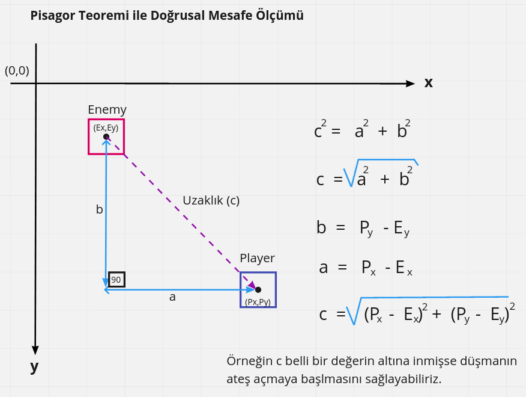
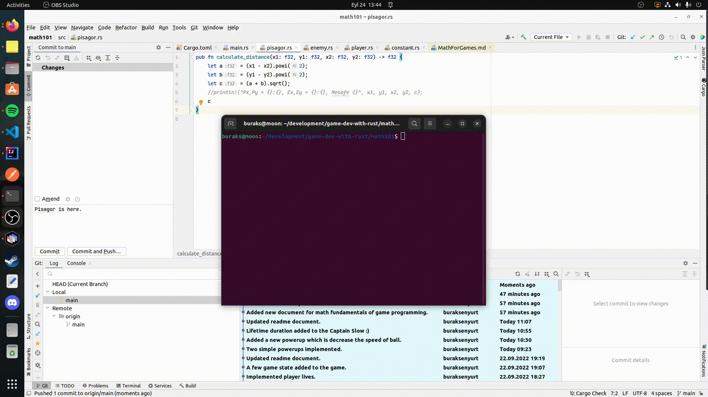
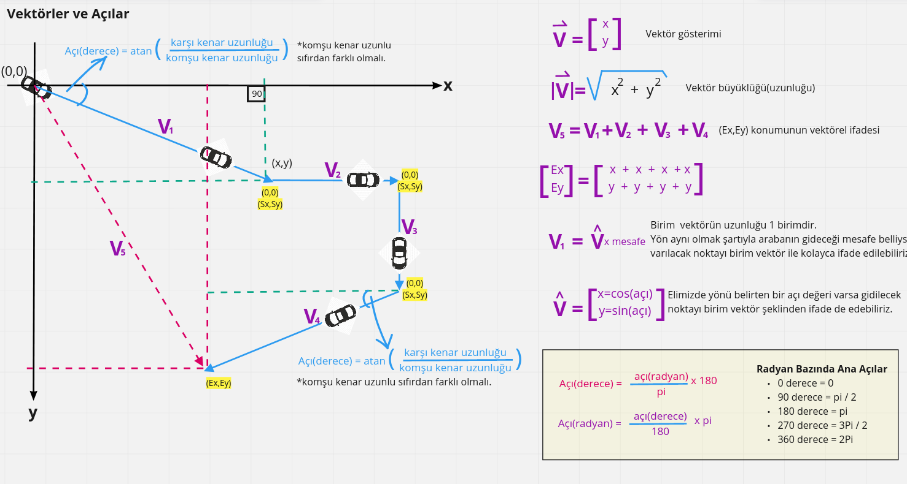
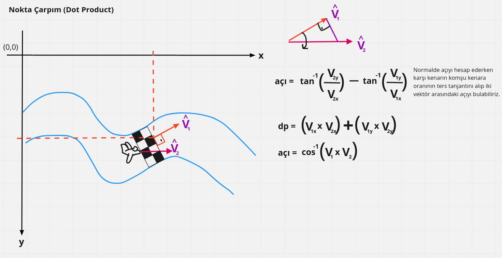
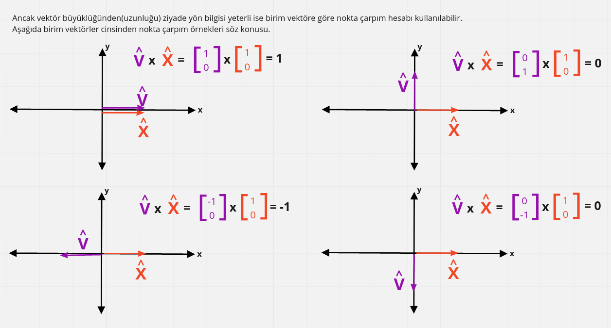

# Oyun Geliştirmede Kullanılan Temel Matematik Enstrümanlar

Oyun motorları arasında popüler olan Unity, Unreal gibi pek çok platform fizik motorlarından, ışıklandırmaya, gölgeleme efektlerinde çarpışma hesaplamalarına kadar pek çok şeyi hazır olarak sunar. Ancak oyun geliştirme üzerine programlamanın temellerinde her zaman olduğu gibi matematik vardır. Aşağıda temel seviyede oyun geliştirme için bilinmesi gereken matematik enstrümanlarına yer verilmekte.

## Pisagor Teoremi

Oyuncunun roketi iki boyutlu sahada ilerlerken etrafını saran düşman gemileri rast gele yönlerde hareket ediyordu. Bazı düşman gemileri belli mesafe kadar yaklaşınca da oyuncunun gemisine ateş etmekteydi. İşte soru; düşman gemisinin ateş etmek için oyuncuya ne kadar yaklaştığını nasıl buluruz? Problemi basitleştirmek adına oyunun iki boyutlu bir sahada yazıldığını düşünelim. Oyunlarda koordinat düzleminin ekranın sol üst köşesini 0,0 başlangıç noktası olarak kabul ettiğini unutmayalım.

Pisagor teoremini math101 isimli rust projesinde deniyoruz. Aşağıda gördülüğü gibi daire, kareye 50 pixel altında yaklaştığında ekrana bir uyarı mesajı geliyor.

## Vektörler ve Açılar

Oyunlarda vektörler sıklıkla kullanılır. Bir vektör ile büyüklük _(daha çok uzunluk olarak da ifade edilir)_ ve en önemlisi yön bilgileri ifade edilebilir. Bu sayede oyun sahasındaki bir nesnenin hareket yönü vektörler ile ifade edilebilir. Büyüklük _(Magnitude)_ yerine yönün _(direction)_ önemli olduğu durumlarda genellikle birim vektörler değerlendirilir. Bir vektörün uzunluğunu _(büyüklüğünü)_ bulmak için pisagor teoremi kullanılabilir. Nitekim uzaydaki bir vektörün uzunluğu iki nokta arasındaki mesafeye tekabül eder ki bu da pisagor üçgeninden yararlanılarak hesap edilir.

Vektörler sayesinde bir noktanın merkeze olan uzaklığını ifade etmek de kolaydır. Örneğin görseldeki araba her yön değiştirdiğin gitti mesafeyi büyüklük olarak kabul eden ve bir yönü olan vektörler ile matematiksel olarak ifade edilebilir. Buna göre aracın son geldiği Ex,Ey noktasının vektörel formdaki karşılığını bulmak kolaydır. Ayrıca Ex,Ey noktasının vektörel ifadesi arabanın merkezden _(merkez olarak başka bir nesne konumu örneğin yol kenarındaki bariyer de kabul edilebilir)_ ne kadar uzakta olduğunu söyler. Lakin az önce belirttiğimiz üzere özellikle iki boyutlu saha kullanan oyunlarda vektörün büyüklüğü _(uzunluğu)_ göz ardı edilebilir. Yön _(direction)_ daha önemlidir. Bu sebeple birim vektöre _(Unit Vector)_ sıklıkla rastlanır. Herhangi bir vektörü normalleştirme _(normalizing)_ işlemine tabi tutarak birim vektör cinsinden ifade etmek mümkündür.

Vektörlerde 0,0 konumuna göre kurulan dik üçgenlerden yararlanılarak yönü belirten açılar hesaplanabilir. Genelde bu hesaplamalar dik üçgenin karşıt kenarı ile komşu kenar arasındaki oranın arktanjantı şeklinde hesaplanır _(tanjantının -1 üssüdür esasında)_ ve derece cinsinden bulunur. Oyun motorlarının çoğunda derece yerine radyan kullanılır. Bir daireyi dört eşit dilim olarak böldüğümüzde radyan ile dilimlerin pi değeri cinsinden ifade edilebilmesi sağlanır. Bulunan açının radyana çevrilmesi ya da tam tersinin yapılması da formüller ile mümkündür.

Yön için önem arz eden açının bulunmasında sadece tanjant değil zaman zaman sinüs ve kosinüs fonksiyonları da kullanılabilir. 

- Elimizde açının karşı kenar uzunluğu ile hipotenüs değeri varsa sinüs fonksiyonundan yararlanılarak açı bulunabilir.
- Elimizde bulunmak istenen açının karşıt kenar uzunluğu ile komşu kenar uzunluğu varsa tanjant fonksiyonundan yararlanılır.
- Son olarak elimizde, bulunmak istenen açının komşu kenar uzunluğu ile hipotenüs değeri varsa kosinüs fonksiyonundan yararlanılabilir.

Bu noktada açı ile vektör arasındaki ilişkiyi ve dolayısıyla bir vektörün yönünü bulmayı iyi anlamak gerekir. Elimizde bir açı varsa birim vektör cinsinden yönü bulmak oldukça kolaydır. Buna göre açının sinüsü y değerini, kosinüsü de x değerini bulmamızı sağlar.

Sinüs eğrisinin kullanıldığı örnek kod parçasının çalışması aşağıdaki gibidir. Sol ve sağ ok tuşlarına basıldığında dairenin x kooridanatı değerine göre sinüs değeri hesaplanır ve y değeri buna göre değiştirilir. Sonuçta altın renkli topun sinüs eğrisine göre hareketi söz konusudur. Tabi normalde sinüs eğrisine baktığımızda ilk hareketin yukarı yönlü başladığını görürüz. Ancak burada koordinat sisteminde 0,0 orjininin ekranın sol üst köşesinde olduğunu hatırlayalım. Yine de y değerinin artım ve azaltımını duruma göre değiştirip aşağı ve yukarı yönlü hareketleri kontrol edebileceğimizi unutmayalım.

## Nokta Çarpım (Dot Product)

İki boyutlu oyun sahasında nesnelerin yönleri arasındaki açının değerlendirildiği pek çok durum var. Örneğin bir uçağın bir checkpoint noktasında geçip geçmediğini anlarken ya da yokuş aşağıya indiğini veya bir yokuşu çıktığını hesaplarken açıları kullanabiliriz. Aşağıdaki gösterimde uçağın yönü ile checkpoint noktasının yönü arasındaki ilişkinin nokta çarpım ile ele alınışı değerlendirilmekte. Bu senaryolarda birim vektörlerin göz önüne alındığını baştan belirteyim. Nitekim vektörün büyüklüğünden ziyade yönü önemli. Birim vektör cinsinden bir nesnenin yönünü ifade ettiğimizde aradaki açıyı bulmak için nokta çarpımı formülasyonundan da yararlanabiliyor. Nokta çarpım hesaplaması ters tanjant ya da ters kosinüs ile bulunan açı hesaplamasına göre işlemciye daha az yük bindiriyor. Yani işlem maliyeti çok daha ucuz. 

Nokta çarpımını birim vektöre indirgediğimizde elde edilen skalar değer -1 ile 1 aralığında olur. Buna göre vektörlerin aynı veya ters yönde olduklarını ya da birbirlerine yaklaştıklarını veya uzaklaştıklarını anlayabiliriz.

_Devam Edecek_