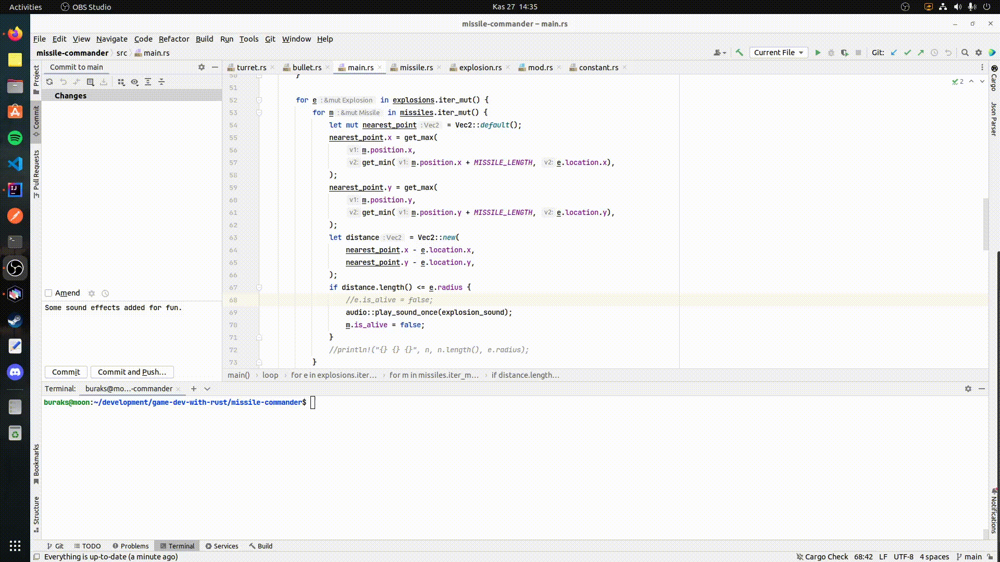
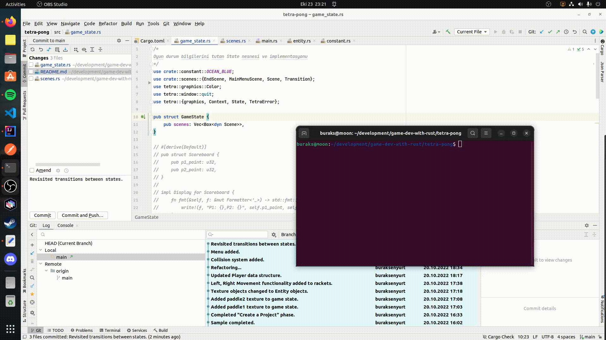
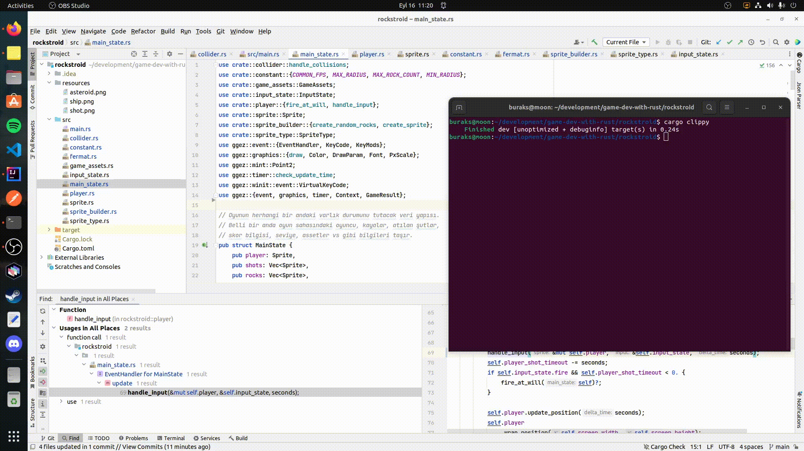

# Hazır Oyun Motorlarını Kullanarak Rust Dili Yardımıyla Oyunlar Geliştirmek

Rust programlama dilinde oyun geliştirmek için popüler birkaç hazır çatıyı nasıl kullanacağımı öğrenmek istiyorum. 

- [x] **12 - wing-pilot-2024;** Bu sefer Commodore 64'te sıkça oynadığım 1942 oyununun bir benzerini Macroquad çatısını kullanarak gerçekleştirmeye çalışıyorum.
- [x] **11 - missile-commander;** Bu örnekte 80lerin meşhur Atari oyunlarından Missile Command'in bir benzerini yazmaya çalışıyorum. Amacım Missile Command arkasındaki matematiği keşfetmek ve Rust örneğinde uygulayabilmek. Ayrıca stage mantığını kurgulamaya ve seviyelerde ilerledikçe oyunu zorlaştırmaya çalışıyorum.
- [x] **10 - life-game;** Conway'in life game oyununu Rust ile yazmaya çalıştım.
- [x] **09 - Wolf-Tank;** Macroquad motorunu kullanarak yazmaya çalıştığım basit bir RPG. Minik bir tankı kontrol etmeye çalışıyoruz.
- [x] **08 - Tetra-Pong;** Basit 2D oyun geliştirme çatılarından olan [Tetra](https://tetra.seventeencups.net/) geliştirilen bir başka Ping-Pong örneği. Sitedeki tutorial'ı takip ediyorum.
- [x] **07 - Spining-Square;** Popüler oyun motorlarından olan [Piston](https://crates.io/crates/piston) ile ilgili Getting Started örneği.
- ~~[ ] **06 - Dragon Fighter;** isimli yeni öğretide Bevy küfesini kullanan bir oyun geliştirmeye çalışıyorum. Tekrardan Entity Component System _(ECS)_ konusunu irdeliyorum. Takip ettiğim örnek [şu github adresinde](https://github.com/mwbryant/rpg-bevy-tutorial/tree/master) yer almakta. Özellikle öğreti serisini branch olarak ayırması takibi kolaylaştırıyor. Tabii örnek bevy'nin 0.6 versiyonu baz alınarak hazırlanmış. Benim kullandığım versiyon ile arada ufak tefek farklılıklar olabiliyor. Bakalım sonuçta ortaya ne çıkacak :)~~ __Youtube video anlatımı yavaşlatmama rağmen pek istediğim öğreticilikte değildir. Bu yüzden iptal ettim.__
- [x] **05 - Math101;** isimli projede oyun programlama için gerekli temel matematik enstrümanlara bakılıyor. [MathForGames](MathForGames.md) isimli dokümanda biraz daha fazla detay bulunabilir.
- [x] **04 - walls_coming;** Sıradaki örnekte tekrardan Tantan'a uğruyorum. Bu kez Breakout oyununun yazılışını anlattığı [öğretiyi](https://youtu.be/xQ9YTY7ZgsI) çalışmaktayım. Bu örnekte [macroquad](https://github.com/not-fl3/macroquad) isimli başka bir oyun kütüphanesi kullanılmakta.
- [x] **03 - rockstroid;** isimli örnek aslında [Asteroids](https://en.wikipedia.org/wiki/Asteroids_(video_game)) türevli bir oyunun klonu. Ggez paketinin örnekleri arasında yer alan oyunu kodundan bakarak yazmaya çalışıyorum. Adım adım anlatımı yapılan bir öğreti olmadığından orta seviyede olsa Rust bilgisine ihtiyaç var. Building Block'ları keşfetmek açısından oldukça yararlı bir çalışma. Kod tarafında net olarak bir Entity Componenet System bulunmuyor ama ona epeyce yaklaşılmış.
- [x] **02 - ggez_101;** ggez küfesinin nasıl kullanıldığını anlamaya çalıştığım bu temel örnekte ekrana rastgele konumlarda ve farklı renklerde dikdörtgenler çizen bir kod parçası yer alıyor. Alt ok tuşuna basınca işleyiş duruyor üst ok tuşuna basınca rastgele konumlarda üretimler devam ediyor.
- [x] **01 - ping_pong;** İlk örnek ile paralel başladığım bu çalışmada ise severek takip ettiğim Youtuber'lardan birisi olan Tantan'ın Ping Pong oyununu yapmaya çalışıyorum. [Şu adreste](https://www.youtube.com/watch?v=TUE_HSgQiG0&list=PLY-17mI_rla7-lZ3Cj4mKLFXgEHaVGHWA) yer alan örnekte [GGEZ](https://crates.io/crates/ggez) crate kullanılıyor.
- [x] **00 - crayz_invaders;** isimli ilk örnekte Jeremy Chone'un [şu adresteki öğretisini](https://www.youtube.com/watch?v=j7qHwb7geIM) birebire takip ederek ilerlemekteyim. Bu örnekte [Bevy](https://crates.io/crates/bevy) isimli Crate kullanılıyor ve Space Invaders benzeri bir konsol oyunu geliştiriliyor. Bevy'nin kullanılması dışında _Entity Component System_ odaklı oyun motorlarının nasıl kullanıldığı da öğreniliyor.

## Örnek Çalışma Zamanları

Henüz geliştirilmesine devam ettiğim Atari Missile Command oyununa ait bir çalışma zamanı görüntüsü aşağıdaki gibidir.

Conway'in Game of Life oyununa ait bir çıktı aşağıdaki gibi oldu. 

Tank Wolf oyununa ait çalışma zamanı görüntüsü aşağıdaki gibidir. Bu ilk sürümde tankın kendi ekseni etrafında dönmesi, döndüğü yöne doğru ateşe edebilmesi, ileriye veya geriye doğru hareket edebilmesi, askeri birliklerin rastgele dizilerek ilkel bir AI mantığında tanka doğru hareket etmesi gibi özellikler yer almaktadır. Çarpışma hesaplamalarında birkaç bug var. Bazı koordinatlarda tank askeri birliğin altından geçmekte ve çarpışma hesabı suya düşmektedir ha haaa :D Bu tip şeyleri düzeltmek lazım ama Macroquad ile çalışmayı öğrenme noktasında bana epeyce deneyim kattığını söyleyebilirim. Diğer yandan AI tarafına iyice çalışmam lazım. Bunun için sanırım Pac Man'in arkasındaki AI matematiğini öğrenmem gerekiyor. Daha zamanım var.

Tetra framework kullanan öğretidekilerden yola çıkarak yazdığım tetra-pong isimli oyunun çalışma zamanı çıktısı da aşağıdaki gibi. GS ile FB karşı karşıya :P Aslında bir ping pong oyunu denemiştim ama farklı bir çatı kullanarak aradaki kolaylıkları kıyaslamaya çalıştım.

Ping Pong örneğine ait çalışma sonuçlarım aşağıdaki gibi. Ekran kaydını mp4'ten gif formatına çevirdiğim için epey dandik ama az da olsa fikir veriyor :)
Güncellenen sürümde oyuncular için kendi taraflarına hareket eden birer iksir var. İksirleri yakaladıklarında ekstradan puanlar kazanıyorlar.

Rockstroid oyununa ait örnek ekran görüntüsü de aşağıdaki gibidir. Farklı bir örneğe geçeceğim için onu da yarım bıraktım :D Birçok bug içeriyor. 

- Söz gelimi bazı açılardaki lazer atışlarında lazer ters açıdan tekrar içeri girip belli bir mesafe kat ediyor. Oyuncu için hile kayalar için kötü :) 
- Lazer materyalinin açısı yanlış ve düzeltilmesi gerekiyor. 
- Uzay gemisine S tuşuna basınca yavaşlama fonksiyonelliği eklenebilir. Lineer interpolasyona göre yavaşlayabilir. Yani yavaşlama hızı artarak devam edip durur. 
- Kayalara hareket ettirilebilir. Çok yavaş da olsa gemiye doğru yönlenebilirler.

