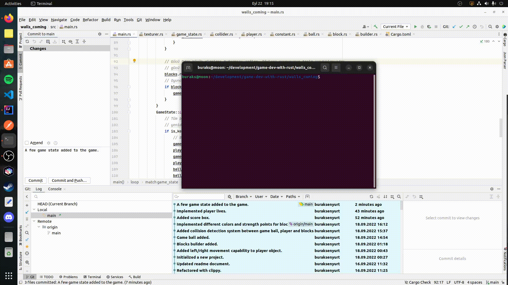

# Hazır Oyun Motorlarını Kullanarak Rust Dili Yardımıyla Oyunlar Geliştirmek

Rust programlama dilinde oyun geliştirmek için popüler birkaç hazır çatıyı nasıl kullanacağımı öğrenmek istiyorum. 

- [x] **Crayz_Invaders** isimli ilk örnekte Jeremy Chone'un [şu adresteki öğretisini](https://www.youtube.com/watch?v=j7qHwb7geIM) birebire takip ederek ilerlemekteyim. Bu örnekte [Bevy](https://crates.io/crates/bevy) isimli Crate kullanılıyor ve Space Invaders benzeri bir konsol oyunu geliştiriliyor. Bevy'nin kullanılması dışında _Entity Component System_ odaklı oyun motorlarının nasıl kullanıldığı da öğreniliyor.
- [x] **ping_pong:** İlk örnek ile paralel başladığım bu çalışmada ise severek takip ettiğim Youtuber'lardan birisi olan Tantan'ın Ping Pong oyununu yapmaya çalışıyorum. [Şu adreste](https://www.youtube.com/watch?v=TUE_HSgQiG0&list=PLY-17mI_rla7-lZ3Cj4mKLFXgEHaVGHWA) yer alan örnekte [GGEZ](https://crates.io/crates/ggez) crate kullanılıyor.
- [x] **ggez_101:** ggez küfesinin nasıl kullanıldığını anlamaya çalıştığım bu temel örnekte ekrana rastgele konumlarda ve farklı renklerde dikdörtgenler çizen bir kod parçası yer alıyor. Alt ok tuşuna basınca işleyiş duruyor üst ok tuşuna basınca rastgele konumlarda üretimler devam ediyor.
- [x] **Rockstroid** isimli örnek aslında [Asteroids](https://en.wikipedia.org/wiki/Asteroids_(video_game)) türevli bir oyunun klonu. Ggez paketinin örnekleri arasında yer alan oyunu kodundan bakarak yazmaya çalışıyorum. Adım adım anlatımı yapılan bir öğreti olmadığından orta seviyede olsa Rust bilgisine ihtiyaç var. Building Block'ları keşfetmek açısından oldukça yararlı bir çalışma. Kod tarafında net olarak bir Entity Componenet System bulunmuyor ama ona epeyce yaklaşılmış.
- [x] **walls_coming:** Sıradaki örnekte tekrardan Tantan'a uğruyorum. Bu kez Breakout oyununun yazılışını anlattığı [öğretiyi](https://youtu.be/xQ9YTY7ZgsI) çalışmaktayım. Bu örnekte [macroquad](https://github.com/not-fl3/macroquad) isimli başka bir oyun kütüphanesi kullanılmakta.
- [x] **Math101** isimli projede oyun programlama için gerekli temel matematik enstrümanlara bakılıyor. [MathForGames](MathForGames.md) isimli dokümanda biraz daha fazla detay bulunabilir.
- ~~[ ] Dragon Fighter isimli yeni öğretide Bevy küfesini kullanan bir oyun geliştirmeye çalışıyorum. Tekrardan Entity Component System _(ECS)_ konusunu irdeliyorum. Takip ettiğim örnek [şu github adresinde](https://github.com/mwbryant/rpg-bevy-tutorial/tree/master) yer almakta. Özellikle öğreti serisini branch olarak ayırması takibi kolaylaştırıyor. Tabii örnek bevy'nin 0.6 versiyonu baz alınarak hazırlanmış. Benim kullandığım versiyon ile arada ufak tefek farklılıklar olabiliyor. Bakalım sonuçta ortaya ne çıkacak :)~~ __Youtube video anlatımı yavaşlatmama rağmen pek istediğim öğreticilikte değildir. Bu yüzden iptal ettim.__
- [x] **Spining-Square:** Popüler oyun motorlarından olan [Piston](https://crates.io/crates/piston) ile ilgili Getting Started örneği.
- [x] Tetra-Pong: Basit 2D oyun geliştirme çatılarından olan [Tetra](https://tetra.seventeencups.net/) geliştirilen bir başka Ping-Pong örneği. Sitedeki tutorial'ı takip ediyorum.

## Örnek Çalışma Zamanları

Ping Pong örneğine ait çalışma sonuçlarım aşağıdaki gibi. Ekran kaydını mp4'ten gif formatına çevirdiğim için epey dandik ama az da olsa fikir veriyor :)
Güncellenen sürümde oyuncular için kendi taraflarına hareket eden birer iksir var. İksirleri yakaladıklarında ekstradan puanlar kazanıyorlar.

Rockstroid oyununa ait örnek ekran görüntüsü de aşağıdaki gibidir. Farklı bir örneğe geçeceğim için onu da yarım bıraktım :D Birçok bug içeriyor. 

- Söz gelimi bazı açılardaki lazer atışlarında lazer ters açıdan tekrar içeri girip belli bir mesafe kat ediyor. Oyuncu için hile kayalar için kötü :) 
- Lazer materyalinin açısı yanlış ve düzeltilmesi gerekiyor. 
- Uzay gemisine S tuşuna basınca yavaşlama fonksiyonelliği eklenebilir. Lineer interpolasyona göre yavaşlayabilir. Yani yavaşlama hızı artarak devam edip durur. 
- Kayalara hareket ettirilebilir. Çok yavaş da olsa gemiye doğru yönlenebilirler.

WallsComing oyununa ait örnek çalışma zamanı çıktısı aşağıdaki gibidir. Oyuna güçlendiriciler de eklendi. Örneğin altın rengi blok oyuncu tahtasının boyunu uzatıyor. Koyu mavi blok topun hızını belli süreliğine azaltıyor ve diğer bir blokta oyuncu tahtasının boyunu ufaltıyor :D 

Tetra framework kullanan öğretidekilerden yola çıkarak yazdığım tetra-pong isimli oyunun çalışma zamanı çıktısı da aşağıdaki gibi. 

