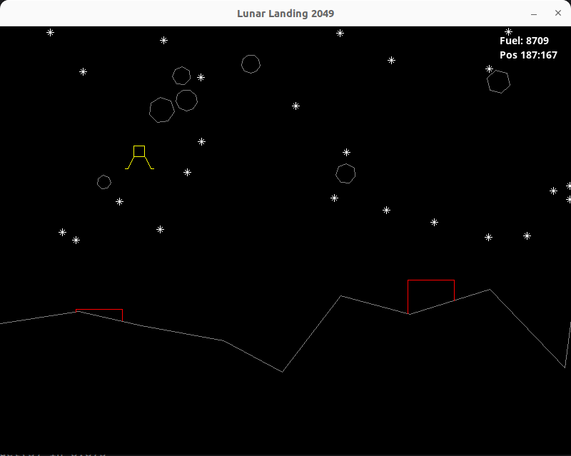

# Lunar Landing Game Design Document

Versiyon 1.0

## Oyun Tanımı

- **Adı  :** Lunar Landing
- **Türü :** Text Tabanlı İniş Simülasyonu
- **Platform :** Terminal(Cross Platform)

## Oyunun Amacı

- **Ana Hedef :** Oyunun amacı mekiği gezegen yüzeyindeki iniş pistlerinden herhangi birisine yakıt tükenmeden, bir göktaşına çarpmadan indirebilmektir.
- **Oynanış Mekanikleri :** Oyun başladığında mekik atmosfere girmiş ve aşağıya doğru dikey iniş hareketindedir. Mekik rastgele anlarda sağa veya sola doğru şiddetli türbülansa maruz kalır. Oyuncu tuşları kullanarak mekiği iniş pistine yönlendirmeye çalışır. Sağ ve sol yön tuşları ile mekiğe yön verir. Aşağı yön tuşuna bastığında mekiğin iniş hızı artar, daha hızlı inmeye başlar. Space tuşuna bastığı takdirde roketlere güç verir ve mekik yukarı doğru yükselir. İniş esnasında gezegen rastgele konumlardan belli açılarda göktaşları düşmeye başlar. Büyüklükleri farklı olan göktaşlarına çarpılması halinde oyun kaybedilir.

## Oyun Dünyası

- **Mekan :** Oyunun hikayesi ay yüzeyinde geçmektedir.
- **Kurallar :** Oyunun temel kuralları aşağıdaki gibidir.
  - Her başlangıçta gezegen yüzeyi rastgele çizilir ve iniş pistleri rastgele konumlanır. Oyuncu bu pistlerden birine inerse görev başarılı tamamlanır.
  - Gezegen yüzeyine rastgele zamanlarda farklı boyutlarda göktaşları düşer. Oyuncu bunlara yakalanırsa oyunu kaybeder.
  - Oyun başlangıcında mekiğin on bin birim yakıtı vardır. Yakıt sürekli azalır. Bazı manevralar daha çok yakıt harcanmasına neden olur. Oyuncu bir iniş pistine ulaşamadan yakıtı biterse oyunu kaybeder.
  - Mekik belli bir irtifanın altına indiğinde ikaz ışığı yanar. İniş pisti yerine gezegen zeminininin sıfır noktasına gelirse oyunu kaybeder.

## Oyun Mekanikleri

Oyun başlatıldığında atmosferin üst katmanında olan mekiğimiz aşağıya doğru belli bir hızda inmeye başlar. Oyuncu sağ, sol, aşağı yön tuşları ve Space tuşunu kullanarak çeşitli yönlendirmeler yapar. Oyun her yeniden başlatıldığında yeryüzü çizimleri ve pistlerin yerleri değişir. Mekikte farklı bir noktadan düşmeye başlar. Oyun akışı sırasında farklı konumlardan meteorlar aşağıya doğru inmeye başlarlar. Meteorlar birkaç boyda olabilirler ve dönerek ilerlerler. Bir meteorun mekiğe çarpması oyunun sonlanması ve kaybedilmesi anlamına gelir. Oyuncu mekiği hareket ettirirken bazı anlarda Space tuşu ile yükselebilir veya aşağı yön tuşuna basarak dikey düşüş hareketini hızlandırabilir. Bu durumlarda daha fazla yakıt harcayacaktır. Mekiğe ait yakıt ve konum bilgileri ekranın sağ üst köşesinde yer alır. Yakıt belli bir değerin altında düştüğünde ekranın sol üst kısmında ikaz uyarısı çıkar. Aynı şekilde mekik belli bir irtifanın altına indiğinde de Altitude ikaz uyarsı yine ekranın sol üst köşesinde çıkar. Oyuncu mekiği iniş pistlerinden birisinin üstüne indirmek üzere hareket ettirir. Burada çok fazla aşağı yön tuşuna basarsa pisti es geçebilir. Bu nedenle pistin üstünde makul bir seviyeye geldikten sonra sadece türbülans düzeltmeleri yapıp olan iniş hareketine uyması gerekir.

## Karakterler

- **Mekik :** Oyuncunun indirmeye çalıştığı basit bir araçtır. Türbülanslardan sıklıkla etkilenir ve farklı yönlenere savrularak oyuncunun işini zorlaştırır.
- **Göktaşı :** Oyunda rastgele periyotlarda atmosfere geren farklı büyüklüklerdeki göktaşlarıdır.
- **İniş Pisti :** Dikey yükselen iniş pistleri genelde dağ zirvelerinin üstünde yer alır. İniş yapmak için yeterli genişlikte pistleri vardır.

## Görsel ve Ses Tasarımı

- **Arayüz Tasarımları :** 
- **Ses ve Müzik :** 

## Kullanıcı Arayüzü ve Deneyimi

Menü ve ekranlara ait tasarımları aşağıdaki gibidir.

Rastgele t anından bir görüntü.

## Geliştirme Takvimi

- **Geliştirme süreci aşamaları :** _Bu döküman için eklenmeyecek._
- **Milestones ve hedef tarihler :** _Bu döküman için eklenmeyecek._

## Teknik Detay

- **Domain Kurgusu :** Oyunda kullanılan veri modelleri aşağıdaki gibidir.
  - Shuttle(Struct) : Mekiğe ait bilgiler.
  - LandingPlatform(Struct) : İniş pisti.
  - Meteor(Struct) : Göktaşı.
  - Hud(Struct) : Head Up Display. Skor ve gösterge bilgileri.
  - GameState(Enum) : Oyun zamanı durumları.
  - Game(Struct) : Temel oyun yöneticisi.

- **Çarpışma Tespiti :** Oyundaki görevi başarıyla tamamlayabilmek için öncelikle mekiğin herhangi bir meteora çarpmadan ve yakıtı bitmeden belirlenen iniş pistlerinden birisine inebilmelidir. Meteor'ların mekiğe çarpıp çarpmadığını anlamak için merkez noktaları arasındaki öklid mesafesinin yarıçapların toplamı ile kıyaslanmasından yararlanılmıştır. Aşağıdaki şekilde bu durum ele alınmaktadır.

- **Teknoloji :** Oyun Rust programlama dili ve SDL2 paketi baz alınarak geliştirilmektedir.
- **Sistem Gereksinimleri :** Terminalden çalışan text tabanlı bir oyun olduğundan minimum sistem gereksinimiyle çalışabilecek şekilde tasarlanmaktadır. Minimum konfigurasyon gereksinimi aşağıdaki gibidir.

| Özellik | Minimum Gereksinim            |
|---------|-------------------------------|
| OS      | Ubuntu 16.04 LTS veya üzeri   |
| CPU     | 1 GHz veya daha hızlı işlemci |
| RAM     | 512 MB veya daha fazla        |
| Disk    | Minimum 25 Mb boş alan        |
