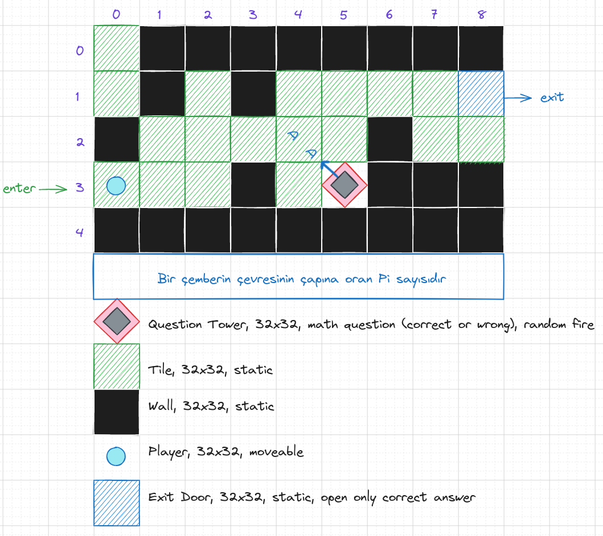
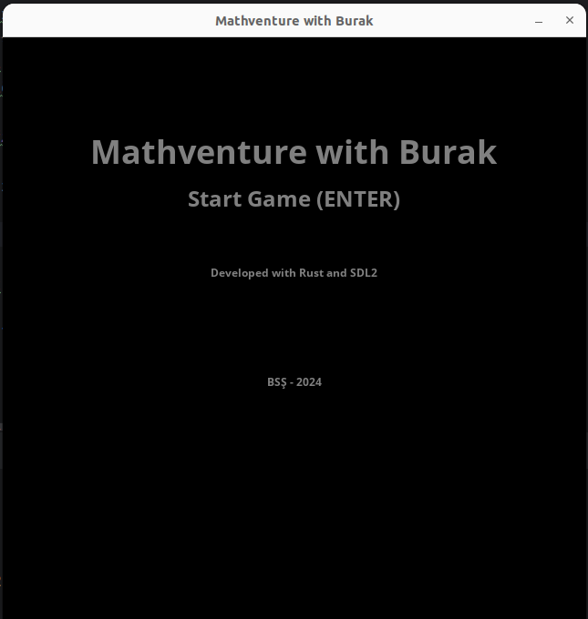
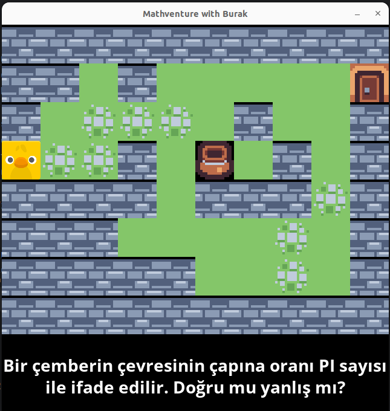
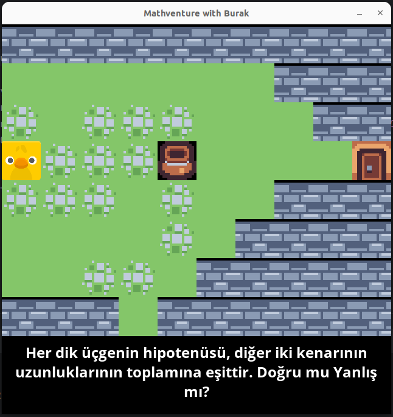
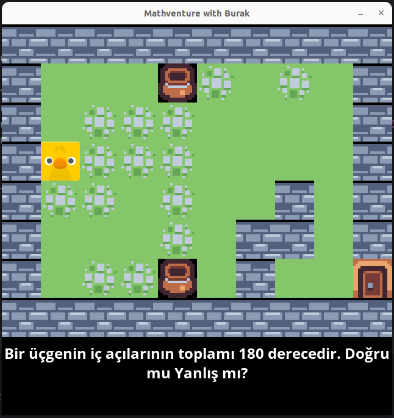

# Mathventure with Burak

Rust programlama dili ve SDL2 kütüphanesini kullanarak geliştirmeye çalıştığım bir 2D Platform macera oyunudur.

## Genel Notlar

Oyunun giriş seviyesindeki labrientini aşağıdaki gibi tasarlamayı düşünüyorum.

## Game Design Document

Oyuna ait taslak tasarım dokümanı aşağıdaki gibidir.

### Oyun Tanımı

- **Adı  :** Mathventure with Burak
- **Türü :** Terminal tabanlı macera (Adventure)
- **Platform :** Linux, Windows, MacOs Terminal
- **Geliştirici :** Burak Selim Şenyurt / Bağımsız Programcı

### Oynanış

- **Hedef :** Oyun birden fazla seviyeden oluşur. Oyuncu çıkış noktasındaki kapıya ulaşıp sonraki seviyeye geçmeye çalışır. Her seviyede bir veya daha çok matematik sorusu vardır. Sorulara ait cevaplar kullelerden oyun sahasına doğru fırlatılır. Oyuncu doğru cevabı yakalarsa çıkış kapısı açılır. Yanlış cevabı verirse kendisine en yakın blok duvar haline gelir ve hareket sahası daralır. Hareket edecek alanı kalmadığında oyun sonlanır.
- **Kontroller :** Yön tuşları ile oyuncu saha içerisinde sağa, sola, aşağıya ve yukarıya doğru hareket edebilir. 
- **Mekanikler :** Oyun birkaç seviyeden oluşur. Oyuncu duvarlardan geçemez, duvar olmayan zeminlerde dört yöne hareket edebilir. Kulelerden sahaya doğru atılan bloklarda matematik sorusuna ait cevaplar yer alır. Doğru cevaplar dışında yanlış cevaplarda yer alır. Oyuncu, doğru cevabı yakalamaya çalışır.
- **Zorluk :** Seviyelerde ilerlendikçe matematik soruları zorlaşır ve kapının açılması gereken soyu sayısı adedi de fazlalaşır. Giriş seviyesinde 1 soru sorulurken örneğin 8nci seviyede 8 farklı soru gelir.
- **Mekan :** Herhangi bir zaman, herhangi bir yer.
- **Kurallar :** Oyunun temel kuralları aşağıdaki gibidir.
    - Oyuncunun sonraki seviyeye geçebilmesi için sorulan tüm soruların doğru cevap içeren bloklarını yakalaması gerekir.
    - Oyuncu duvarlardan geçemez.
    - Oyuncu yanlış cevapları yakaladıkça kendisine yakın bloklar duvara dönüşür.
    - Seviye çıkış kapısı başlangıçta kitlidir. Doğru cevaplar ile açılabilir.

### Oyun Mekanikleri

- **Player :** Oyuncu bir kare içerisinde sığabilecek büyüklüktedir. Sağ, sol, yukarı ve aşağı yönlü hareket edebilir.
- **Duvar (Wall) :** Sabit nesnelerdir. Oyuncu içinden geçemez. 32x32 pixel gibi kare boyutlardadır. 
- **Zemin (Tile, Stone Tile) :** Oyuncunun üzerinde hareket edebildiği zeminlerdir. Düz çimen veya taşlıklı çimen olabilir.
- **Soru Kulesi(Question Tower):** Sorulan soruya ait tanımlı cevapları fırlatır. Doğru cevap haricinde yanlış cevaplar da fırlatır. Oyundaki konumu sabittir ama seviyeden seviyeye değişiklik gösterir.
- **Seviye Çıkış Kapısı(Exit Door):** Çıkış kapısını ifade eden bloktur. Sabit konumdadır, her seviyede yeri değişir.

### Görsel ve Ses Tasarımı

- **Görsel Stil :**
    - Görsel tasarım tamamen vektör tasarımlara yöneliktir.
    - Renk tonlaması olarak temel renk skalasından yararlanılır.
- **Ses ve Müzik :**
    - Ses efektleri...
    - Arka fon müziği kullanılmamaktadır.

### Kullanıcı Arayüzü ve Deneyimi

Menü ve ekranlara ait tasarımları aşağıdaki gibidir.

Ana menü

Oyun aşağıdaki gibi farklı seviyelerden oluşur.

I. Seviye

II. Seviye

III. Seviye

Oyuncu yanlış cevap verip yandığı takdirde...

_EKRAN GÖRÜNTÜSÜ GELECEK_

### Geliştirme Takvimi

- **Geliştirme süreci aşamaları :** _Bu döküman için eklenmeyecek._
- **Milestones ve hedef tarihler :** _Bu döküman için eklenmeyecek._

### Teknik Detay

- **Motor :** Oyun Rust programlama dili ve SDL2 kullanılarak geliştirilmiştir. Belli bir oyun motoru kullanılmamaıştır.
- **Domain Kurgusu :** Oyunda kullanılan veri modelleri aşağıdaki gibidir.
    - Block(Struct) :
- **Sistem Gereksinimleri :** Terminalden çalışan text tabanlı bir oyun olduğundan minimum sistem gereksinimiyle çalışabilecek şekilde tasarlanmaktadır. Minimum konfigurasyon gereksinimi aşağıdaki gibidir.

| Özellik | Minimum Gereksinim            |
|---------|-------------------------------|
| OS      | Ubuntu 16.04 LTS veya üzeri   |
| CPU     | 1 GHz veya daha hızlı işlemci |
| RAM     | 512 MB veya daha fazla        |
| Disk    | Minimum 15 Mb boş alan        |

### Pazarlama ve Hedef Kitle

- **Hedef Kitle :**
    - Sadece Rust dilini ve SDL2 kütüphanesinin örnek kullanımını öğrenmeye çalışan amatör oyun geliştiricileri.
- **Pazarlama Stratejisi:** NAN
