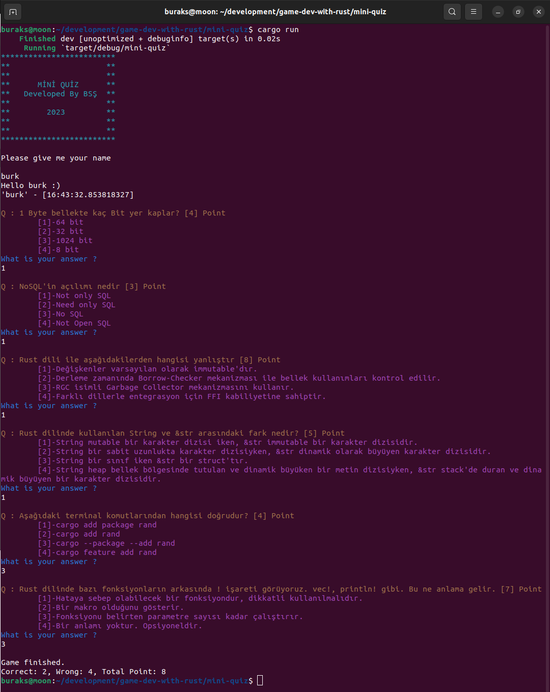

# Mini Quiz

Mini quiz basit bir terminal oyunudur. Oyuncuya 4 şıktan oluşan sorular sorulur ve cevaplarına göre aldığı puan gösterilir. Oyun Rust dili ile yazılmıştır ve aşağıdaki özelliklere sahiptir.

- Sorular bir JSON dosyasında okunur ve sistemde dolaşıma Vector olarak devam eder.
- Kullanıcı olmayan bir şıkkı işaretlediğinde bu soru kuyruğa alınır ve tekrardan sorulur.
- Sınav tamamlandığında doğru ve yanlış cevaplanan soru sayısı ve toplam puan bilgisi verilir.

## Kullanılan Küfeler(Crates)

Programda kullanılan yardımcı küfeler ise şöyledir;

- Ekranı renklendirmek için **colorized**
- json dosyasını parse edip model nesnelerine almak için **serde** ve **serde_json**
- Soru havuzunun her seferinde karıştırılarak alınmasıdan kullanılmak üzere **rand**

## Çalışma Zamanı

```
cargo run
```

