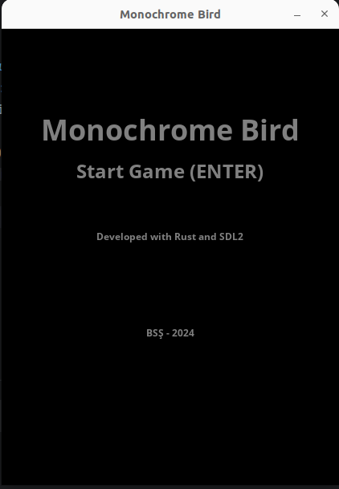
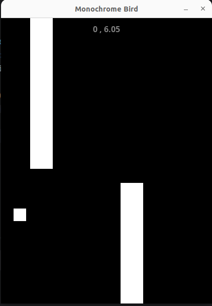
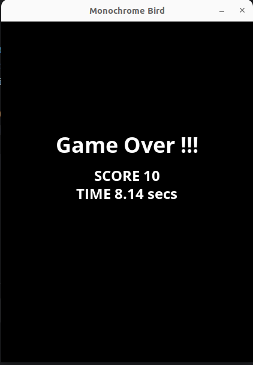

# Mono Bird

Rust programlama dili ve SDL2 kütüphanesini kullanarak geliştirmeye çalıştığım basit bir Flappy Bird klonu.

## Genel Notlar

Lunar Landing isimli terminal oyununda da SDL2 kütüphanesini kullanmıştım. Bu klon oyunda da aynı kütüphaneyi kullanıyorum. Bu sefer bir oyun motorunun temellerini de atmaya çalışıyorum. Örneğin main fonksiyonunda doğrudan oyun döngüsünü başlatmak yerine, bazı setup ayarlamalarının yapıldığı, asıl game nesnesinin kullanıldığı bir başka nesneden yararlanmaya çalışıyorum.

```rust
fn main() -> Result<(), String> {
  let game = Game::default();
  let screen = Screen::new("Monochrome Bird".to_string(), SCREEN_WIDTH, SCREEN_HEIGHT);
  let mut engine = EngineBuilder::new()?
          .setup_screen(screen)?
          .add_game(Box::new(game))
          .change_fps(60)
          .build()?;
  engine.run()
}
```

Burada EngineBuilder tarafında basit Builder tasarım kalıbını ele alarak Fluent API yaklaşımında olduğu gibi bir engine nesnesi oluşturmaya çalışıyorum. Rust tarafındaki pek çok oyun motorunda buna benzer bir yaklaşım söz konusu. Bunu keşfetmeye çalışıyorum diyebilirim. 

Çalışmadaki amaçlarımdan birisi de oyun geliştirirken ki soyutlamaları daha doğru kullanabilmek ve hatta ECS _(Entity Component System)_ ihtiyacını ortaya koyabilmek. 

### Sorular

- Bazı temel geometrik şekillerin bir Sprite olarak daha kolay oluşturulmasını sağlayacak mekanizmaları oyun motoruna nasıl dahil edebilirim. _(Belki de Engine'den bağımsız ayrı bir modül bu tip grafik işleri ele almalıdır)_
- Game nesnesindeki State yönetiminde problemler var. Buradaki State'ler ile Engine tarafındaki State'ler sıkı bağlı _(Tightly Coupled)_ gibi. Engine tarafına Game nesnesinin ihtiyaç duyacağı State bilgilerinden bağımsız yönetebilmeliyim diye düşünüyorum.
- Menüler şu anda Engine veri yapısı tarafından yönetiliyor. Engine'e menüleri dışarıdan nasıl öğretebilirim?

## Game Design Document

Oyuna ait taslak tasarım dokümanı aşağıdaki gibidir.

### Oyun Tanımı

- **Adı  :** Mono Bird
- **Türü :** Terminal tabanlı Arcade / Obstacle Avoidance (Macera / Engelden Kaçınma)
- **Platform :** Linux, Windows, MacOs Terminal
- **Geliştirici : ** Burak Selim Şenyurt / Bağımsız Programcı

### Oynanış

- **Hedef :** Oyunda amaç borulara çarpmadan mümkün olan en uzak mesafeye uçabilmektir.
- **Kontroller :** Oyun tek bir kontrol mekanizmasına sahiptir. Oyuncu Space tuşuna basarak yönettiği kuşun bir miktar irtifa kazanmasını sağlar. Space tuşuna basılmadığında kuş irtifa kaybeder.
- **Mekanikler :** Oyun sürekli akan moddadır. Başlangıç konumunda yer alan kuş karakteri ekranın sağ tarafından gelen borulara çarpmadan uçmaya çalışır. Kuş yer çekimi etkisi ile sürekli aşağıya doğru iner. Oyuncu Space tuşunu kullanarak kuşun irtifasını yukarı çıkarabilir. İrtifayı ayarlayarak borulara çarpmadan uçmaya çalışır. Geçilen her engelden sonra oyuncu belli değerde puan kazanır.
- **Zorluk :** Oyunun zorluğu borular arasındaki mesafe ve boruların yüksekliğine göre değişir. Bu özellikler oyun boyunca sabit kalırken oyuncunun reaksiyon hızı ve zamanlaması önem kazanır.
- **Mekan :** Herhangi bir zaman, herhangi bir yer.
- **Kurallar :** Oyunun temel kuralları aşağıdaki gibidir.
  - Oyunucunun yönettiği kuş herhangi bir boruya temas ettiği andan oyun sonlanır.
  - Oyuncu yönettiği kuşun irtifasını yukarı yönlü hareketle artırabilir.
  - Birinci seviyede oyun sahasında aynı anda en fazla 5 Block olabilir.

### Oyun Mekanikleri

- **Bird (Oyuncu Karakteri) :** Oyundaki ana karakterdir. Oyuncu tarafından yönetilir.
- **Engeller (Blocks) :** Ekranın alt tarafından üste veya üst tarafından alta doğru uzanan boruları temsil eder. Farklı boyutlarda ve uzunluklarda rastgele oluşur.

### Görsel ve Ses Tasarımı

- **Görsel Stil :**
    - Görsel tasarım tamamen vektör tasarımlara yöneliktir.
    - Renk tonlaması olarak sadece siyah, beyaz ve gri kullanılmıştır.
- **Ses ve Müzik :**
    - Ses efektleri basittir(Sadece kanat çırpma sesi ve puan kazanma sesi)
    - Arka fon müziği kullanılmamaktadır.

### Kullanıcı Arayüzü ve Deneyimi

Menü ve ekranlara ait tasarımları aşağıdaki gibidir.

Ana menü



Oyun zamanı



Oyuncu yanarsa



### Geliştirme Takvimi

- **Geliştirme süreci aşamaları :** _Bu döküman için eklenmeyecek._
- **Milestones ve hedef tarihler :** _Bu döküman için eklenmeyecek._

### Teknik Detay

- **Motor :** Oyun Rust programlama dili ve SDL2 kullanılarak geliştirilmiştir. Belli bir oyun motoru kullanılmamaıştır.
- **Domain Kurgusu :** Oyunda kullanılan veri modelleri aşağıdaki gibidir.
  - Block(Struct) :
- **Sistem Gereksinimleri :** Terminalden çalışan text tabanlı bir oyun olduğundan minimum sistem gereksinimiyle çalışabilecek şekilde tasarlanmaktadır. Minimum konfigurasyon gereksinimi aşağıdaki gibidir.

| Özellik | Minimum Gereksinim            |
|---------|-------------------------------|
| OS      | Ubuntu 16.04 LTS veya üzeri   |
| CPU     | 1 GHz veya daha hızlı işlemci |
| RAM     | 512 MB veya daha fazla        |
| Disk    | Minimum 15 Mb boş alan        |

### Pazarlama ve Hedef Kitle

- **Hedef Kitle :**
    - Sadece Rust dilini ve SDL2 kütüphanesinin örnek kullanımını öğrenmeye çalışan amatör oyun geliştiricileri.
- **Pazarlama Stratejisi:** NAN
