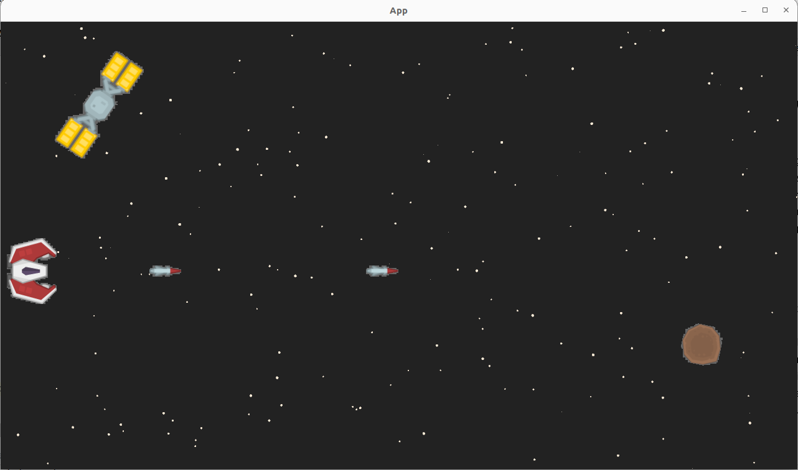
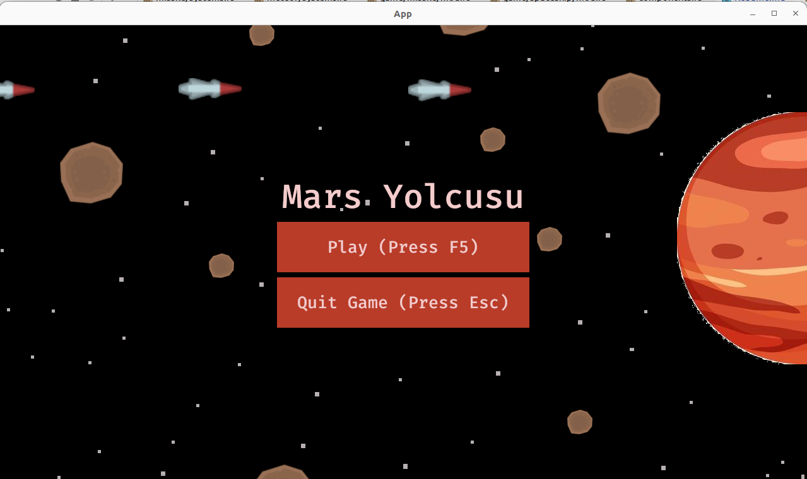
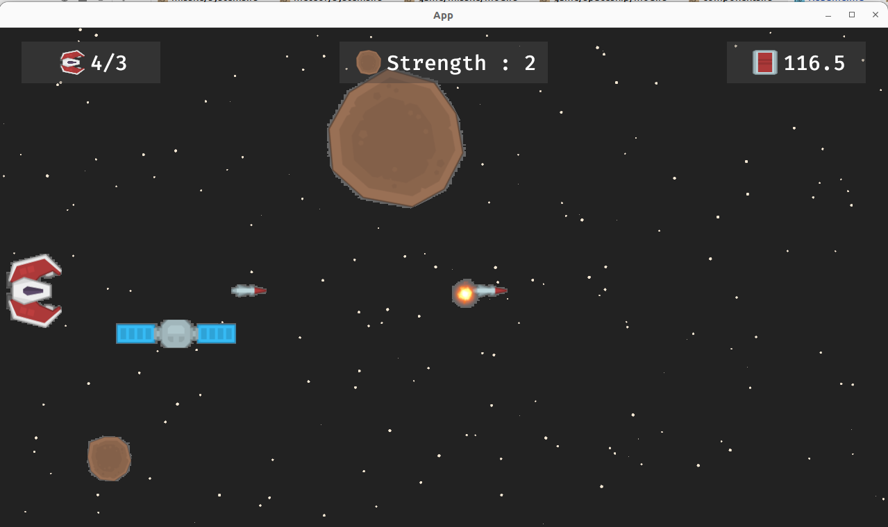

# On My Way

Bevy oyun motoru kullanılarak yazılan bu terminal oyununda uzayda ilerleyen yalnız bir geminin göktaşları ile mücadelesine tanık oluyoruz. Aracın yakıtı belli ancak aralarda bazı istasyonlar var ve üstünden geçince yakıt belli değerlerde tekrardan yüklenebiliyor. Gemi sahip olduğu füzeleri ile meteorları vurup engellerin üstesinden gelebilir. Ancak her füzenin bir fırlatma maliyeti var ve bu yakıtta azalma anlamına gelir. Füzeleri 1.5 saniyede bir ateşleyebiliriz.

Oyuna ait ilk ekran görüntülerinden birisi,

Güncel ekran görüntüleri ise şöyle,

## Öğrenme Noktaları

- Entity Component System sorgularının kullanımı pekiştirildi.
- Proje yapısının entity bazında daha düzgün oluşturulabilmesi sağlandı.
- Plugin kullanımı öğrenildi.
- UI Katmanı ile menülerin nasıl oluşturulacağı öğrenildi.
- Arkaplan için ImageBundle nasıl kullanılır keşfedildi.
- Patlamak efekti kullanımı anlaşıldı.

## Mücadele Noktaları

- Missile ve Meteor entity'lerinin arasındaki mesafeye göre çalışan sistemlerde bir problemim var. Örneğin meteorun gücü 3ncü seviye ise en az 3 füze atılarak vurulabilir. Ancak ilgili sistem metodum frame başına çalıştığından tek füze ile meteor patlayabiliyor. Burayı bir şekilde çözmem lazım. **(Çözüldü: Missile bileşenlerine disposable isimli bir alan ekledim. Missile ve Meteor çarpışmanlarını tespit eden sistem metodunda bu alan true'ya çekiliyor. Başka bir sistem true değeri almış Missile entity'lerini despawn ediyor. Böylece gücü 3 olan bir meteor için 3 füze isabet ettirmek gerekiyor. Hem de merkezden :D )**
- Uzay gemisi bir istasyondan geçerken rastgele bir değere göre belli süre boyunca(aradaki mesafe değerine göre) yakıt alabiliyor. Buradaki yakıt yüklenme durumunu ekranda transparan bir skala ile göstermek istiyorum. (Progress Bar tarzı bir şey)
- Oyundaki güncel ölçümleri ekranda göstermek istiyorum. Anlık yakıt miktarı, füze sayısı, ekrandaki meteor sayısı, vurulan/kaçırılan meteor sayıları gibi. **(Belli ölçüm değerleri Head Up Display sistemi üstünden gösterildi)**
- Oyuna bir menü eklemek istiyorum. **(Eklendi)**
- İlerleyen zamanlarda belki birer seviye eklemeye çalışabilirim. Seviye atladıkça oyun zorlaşır. Meteor sayısı artabilir, füze maliyetleri yükseltilebilir.