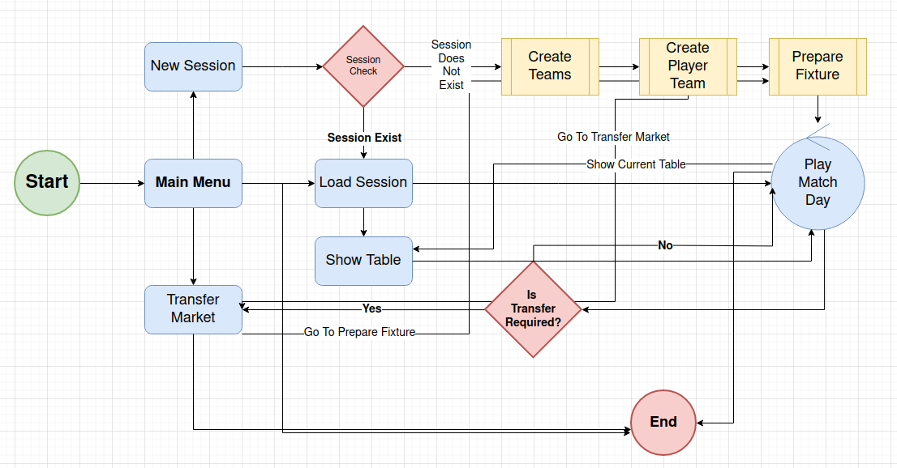

# Slam Dunk Manager Game Design Document

Döküman Versiyonu 1.0

## Oyun Tanımı

- **Adı  :** Slam Dunk Manager
- **Türü :** Basketbol Menajerlik
- **Platform :** Terminal(Cross Platform)

## Oyunun Amacı

- **Ana Hedef :** Oyunun ana amacı takım koçunun, yönettiği basketbol takımını lig veya turnuva şampiyonu yapması veya olabildiğince iyi bir sıralamada bitirmesidir.
- **Oynanış Mekanikleri :** Oyuncu sıfırdan takım kurar, oyuncu pazarından takımı için oyuncu transfer eder ve bu işlemleri tamamlamasını takiben lig başlar. Maçlar simülasyon algoritması ile oynanır.

## Oyun Dünyası

- **Mekan :** Oyun günümüz dünyasında, hayali takım ve oyuncu isimlerinden oluşan 8 takımlı bir lig olarak kurgulanmıştır.
- **Kurallar :** Oyunun temel kuralları aşağıdaki gibidir.
  - Lig 3X3 turnavalar içerecek şekilde tasarlanır. 
  - Her takımın en fazla 5 oyuncusu olabilir. Sahada 3 oyuncu ve yedekte 2 oyuncu.
  - Takımlar lig başlangıcındaki savunma ve hücum güçleri algoritma tarafından belirli kıstaslara göre otomatik olarak belirlenir. Lig oynandıkça skor ve başka parametrelere göre bu değerler düşer veya artar.
  - Oyuncu oyuna başladığında lig sonlanana ya da ligi bilinçli olarak sıfırlayana kadar sadece tek bir takım kurabilir.
  - Oyuncunun takımını kurması için başlangıçta belli bir bütçesi bulunur. Ligler tamamlandıkça ve oyun sıfırlanmadığı sürece bu bütçe yapılan harcamalara veya oyuncu satışlarına göre değişiklik gösterebilir.
  - Oyuncu transferleri transfer marketten yapılır.
  - Oyuncu, takımını kurarken maksimum 5 oyuncu transfer edebilir.
  - Transfer serbestliği lig boyunca vardır. Ligin herhangi bir zamanında oyuncu satılabilir veya alınabilir.

## Oyun Mekanikleri

- **Takım Yönetimi :** 8 takımlı bir lig başlatıldığında 7 takım rastgele oyunculara sahip olaraktan otomatikman oluşturulur. 8nci takım koçun vereceği isme bağlı olarak transfer marketten bütçeye göre alınan oyunculardan oluşturulur.
- **Bütçe Yönetme :** Koçun lig başlangıcında kullanabileceği belli bir bütçe vardır. Lig başlarken oyuncu havuzundan rastgele oyuncular rastgele 7 takıma dağılır. Kalan oyuncular transfer markette kalır. Takım koçu bu oyuncu havuzundan bütçesine göre transfer yapar ve kendi takımını kurar. Lig boyunca takım bütçesi ve transfer marketteki havuza göre oyuncu transferleri yapılabilir ama 5 oyuncusu varsa ancak elindeki kadrodan oyuncu satışı yaptığı takdirde yeni bir oyuncu alabilir.
- **Maç Simülasyonu :** Maçların simülasyonu iki şekilde yapılabilir.
	- **Otomatik Mod :** Maç günü otomatik olarak oynanır. Maç günü başlarken koç isterse ilk 3 oyuncusunu seçebilir veya bu atamayı algoritmaya bırakabilir. Skorlar kısa bir gecikme süresi sonrasında diğer maçlarla birlikte toplu olarak tabloya yansıtılır.
	- **Canlı Mod :** Bu modda koçun sahip olduğu takımın maçı 1 dakikalık süre içerisinde işletilir. Maç akışı terminal penceresine yansıtılır. Bu modda oyuncuların enerji seviyeleri ilk başlangıçta aynı olup oyun simülasyonu sırasında değişiklik gösterir. Örneğin pozisyon, boy, şut denemesi, ribaund denemesi ve oyunda kalma süresine göre giderek azalır. Belli bir seviyenin altına inildiğinde oyuncu değişikliği gerekir. Oyuncu enerji seviyeleri sadece canlı maç simülasyonu modunda geçerlidir.
- **Oyuncu Yönetimi :** Takım koçunun bilgileri oyun başlangıcında alınır ve oyunun kendi veritabanına kaydedilir. Lig veya ligler oynandıkça ve oyuncu kendi profil bilgilerini kasıtlı olarak sıfırlamadığı sürece koçun karnesi de değişitir. Koçun kurduğu takımın elde ettiği galibiyet ve mağlubiyetlere göre bir skor kartı işletilir.

## Karakterler

**- Takım Koçu :** Koç takımın yöneticisidir. Oyun başlarken kendisini tanıtır, lig başlarken takım adını belirler, transfer marketi kullanarak oyuncular seçer, lig boyunca oyuncu satışı veya transferi gerçekleştirebilir. 
**- Takım Oyuncusu :** Oyuncular guard, shooter guard, short forward, power forward, pivot gibi pozisyonlara sahiptir. Enerji seviyeleri ve bazı temel istatistik ortalamaları mevcuttur.
**- Takımlar ve Özellikleri :** Ligde 7 + oyuncunun takımı olmak üzere 8 takım vardır. Takımlar 5er kişilik kadrolardan oluşur. Maçlara 5 kişi olarak çıkılır ve maçı 3 kişi yapar. Her takımın hücum ve savunma güçleri vardır. Bunlar ligin ilerleyişine göre belirli koşullar altında azabilir veya artabilir.

## Görsel ve Ses Tasarımı

- **Arayüz Tasarımları :** Kullanıcı Arayüzü kısmında değinilmektedir.
- **Ses ve Müzik :** Slam Dunk Manager terminalden çalışan bir oyundur ve bu nedenle sadece metinsel ifadelerin renklendirilmesi geçerlidir. Oyunda herhangi bir müzik veya ses efekti şu an için planlanmış değildir. 

## Kullanıcı Arayüzü ve Deneyimi

Menü ve ekranlara ait tasarımları aşağıdaki gibidir. Çok basit anlamda oyundaki menüler arası akış ve ana işlemler için aşağıdaki diagramda yer alan akış söz konusudur.



Oyunun ana menüsünde New Season, Load Season, Transfer Market seçenekleri bulunur. New Season ile yeni bir lig sezonu başlatılır ancak önceden devam etmekte olan bir sezon varsa bu sezon silinsin mi yoksa oradan devam edilsin mi diye koça sorulur. Yeni bir lig sezonu başlatılırsa önce takımlar oyuncu havuzundan rastgele oyuncularla eşleştirilerek algoritma tarafından belirlenir. Oyuncudan takımına bir isim vermesi istenir ve transfer market durumuna geçilir. Burada takım için oyuncular seçilir ve sonrasında fikstürün belirlendiği adım başlatılır. Fiktür algoritma tarafından otomatik olarak hazırlandıktan sonra ilk maç gününe geçilir, karşılaşmalar gösterilir. Play Match Day kendi içinde daha kapsamlı bir yapıya sahiptir. Maçları oynatmak, durdurmak, oyuncu değişikliği yapmak, eş zamanlı maç izlenmesi gibi detaylı işlevleri vardır.

### Oyun Ana Menüsü

```text
--------------------------------
----- (N)ew Session ------------
----- (L)oad Session------------
----- (T)ransfer Market --------
--------------------------------
```

### New Session Menüsü

### Maç Simülasyon Ekranı

### Güncel Puan Durumu Ekranı

Yeni bir sezon başlatıldığında puan tablosu aşağıdaki gibi görünür.

```text
----------------------------------------------------------------
--------------------NC2A Pre Session        --------------------
----------------------------------------------------------------
      Team Name            GP  W   L   Points+  Points-  Diff     
 1  - Eagles               0   0   0   0        0        0        
 2  - Wolves               0   0   0   0        0        0        
 3  - Sharks               0   0   0   0        0        0        
 4  - Dragons              0   0   0   0        0        0        
 5  - Lions                0   0   0   0        0        0        
 6  - Bears                0   0   0   0        0        0        
 7  - Hawks                0   0   0   0        0        0        
----------------------------------------------------------------
```

Maçlar oynandıkça puan tablosundaki sıralama değişir. Örneğin 3ncü maç gününden sonra durum aşağıdaki tablodakine benzer olur.

```text
----------------------------------------------------------------
--------------------NC2A Pre Session        --------------------
----------------------------------------------------------------
      Team Name            GP  W   L   Points+  Points-  Diff     
 1  - Lions                3   3   0   45       9        36       
 2  - Academy Ist          3   2   1   47       17       30       
 3  - Dragons              3   2   0   29       23       6        
 4  - Bears                3   1   1   67       9        58       
 5  - Wolves               3   1   2   50       0        50       
 6  - Eagles               3   1   2   39       4        35       
 7  - Hawks                3   1   2   50       26       24       
 8  - Sharks               3   0   3   33       32       1        
----------------------------------------------------------------
```

### Fikstür Ekranı

### Transfer Market Ekranı

Transfer market ekranında transfer edilebilecek oyuncuların listesi yer alır. Oyuncuların numarası, tam ismi, oynadığı pozisyon, boy, transfer değeri ve istatistik ortalamalarına yer verilir.

```text
----------------------------------------------------------------
--------------- TRANSFER MARKET (73.91) Million $---------------
----------------------------------------------------------------
# 03-Riley Williams           Combo Guard 199.06cm 4.24 $
	Pnt      Reb      Ass      Blc      Ste      Trn     
	13.26    6.14     7.76     1.21     2.43     0.20    
# 08-Alex Wilson              Shooting Guard 207.63cm 6.24 $
	Pnt      Reb      Ass      Blc      Ste      Trn     
	17.65    9.29     1.42     0.99     1.25     3.70    
# 09-Morgan Martinez          Combo Guard 218.90cm 5.24 $
	Pnt      Reb      Ass      Blc      Ste      Trn     
	29.92    3.51     7.18     2.66     0.02     0.50    
# 11-Cameron Thomas           Small Forward 189.94cm 3.11 $
	Pnt      Reb      Ass      Blc      Ste      Trn     
	7.99     6.11     4.26     1.96     0.06     1.74    
----------------------------------------------------------------
```

- **Kullanıcı etkileşimi :** Oyuncu terminale gelen oyun isteklerine klaveyeden yaptığı girdilerle cevap verir. Menü seçeneklerindeki sayısal değerlere basarak menüler arası geçiş yapar.

## Geliştirme Takvimi

**- Geliştirme süreci aşamaları :** _Bu döküman için eklenmeyecek._
**- Milestones ve hedef tarihler :** _Bu döküman için eklenmeyecek._

## Teknik Detay

- **Teknoloji :** Oyun Rust programlama dili ve minimum seviyede üçüncü parti küfeler kullanılarak geliştirilmektedir. Tamamen terminalden çalışan metin tabanlı bir oyun olarak tasarlanmaktadır. Geliştirme ortamı olarak Rust Rover IDE'sinden yararlanılır. Oyun kodlaması Ubuntu 22.04 platformu üstünde yapılmaktadır.  
- **Sistem Gereksinimleri :** Terminalden çalışan text tabanlı bir oyun olduğundan minimum sistem gereksinimiyle çalışabilecek şekilde tasarlanmaktadır. Minimum konfigurasyon gereksinimi aşağıdaki gibidir.

| Özellik | Minimum Gereksinim            |
|---------|-------------------------------|
| OS      | Ubuntu 16.04 LTS veya üzeri   |
| CPU     | 1 GHz veya daha hızlı işlemci |
| RAM     | 512 MB veya daha fazla        |
| Disk    | Minimum 25 Mb boş alan        |
